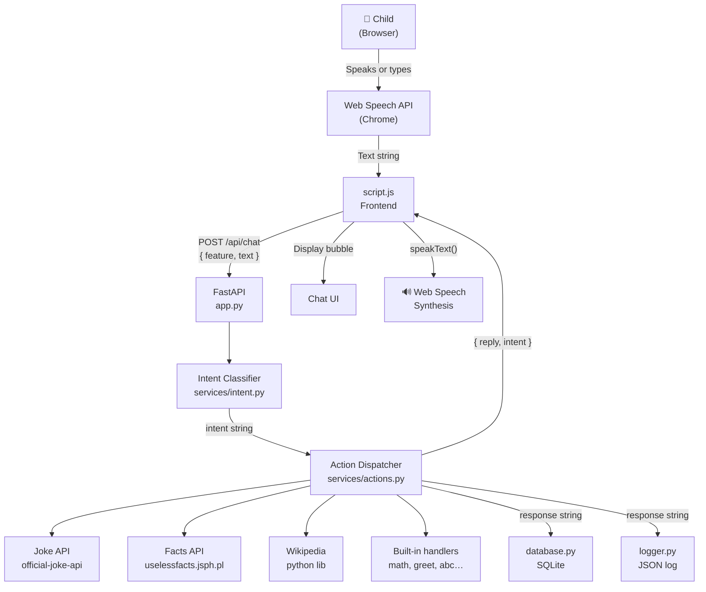

# Smart Toy — Full Architecture

## Overview

A kid-friendly AI toy web app. The user speaks or types a question in the browser; the FastAPI backend classifies the intent and dispatches to the right handler; the response is saved to SQLite, logged to a JSON file, and sent back to the browser where it's displayed and spoken aloud via Web Speech API.

---

## Data Flow



---

## Components

### Frontend — `static/`

| File | Role |
|---|---|
| [static/script.js](file:///c:/Users/Bhavya%20Sri/OneDrive/Desktop/smart%20toy/static/script.js) | Speech recognition, typed input, fetch to backend, spinner, localStorage history |
| [static/style.css](file:///c:/Users/Bhavya%20Sri/OneDrive/Desktop/smart%20toy/static/style.css) | Nunito font, gradient palette, animated robot, pop-in bubbles, loading spinner |
| [templates/index.html](file:///c:/Users/Bhavya%20Sri/OneDrive/Desktop/smart%20toy/templates/index.html) | Page shell — chat area, 4 feature buttons, text input, spinner element |

### Backend — root

| File | Role |
|---|---|
| [app.py](file:///c:/Users/Bhavya%20Sri/OneDrive/Desktop/smart%20toy/app.py) | **FastAPI** entry point — routes, startup, request/response models |
| [database.py](file:///c:/Users/Bhavya%20Sri/OneDrive/Desktop/smart%20toy/database.py) | SQLite storage — [init_db](file:///c:/Users/Bhavya%20Sri/OneDrive/Desktop/smart%20toy/database.py#19-32), [save_conversation](file:///c:/Users/Bhavya%20Sri/OneDrive/Desktop/smart%20toy/database.py#34-42), [get_history](file:///c:/Users/Bhavya%20Sri/OneDrive/Desktop/smart%20toy/database.py#44-52) |
| [logger.py](file:///c:/Users/Bhavya%20Sri/OneDrive/Desktop/smart%20toy/logger.py) | Structured JSON logger — writes to [logs/smart_toy.log](file:///c:/Users/Bhavya%20Sri/OneDrive/Desktop/smart%20toy/logs/smart_toy.log) |

### Services — `services/`

| File | Role |
|---|---|
| [services/intent.py](file:///c:/Users/Bhavya%20Sri/OneDrive/Desktop/smart%20toy/services/intent.py) | Keyword → intent classifier ([joke](file:///c:/Users/Bhavya%20Sri/OneDrive/Desktop/smart%20toy/services/actions.py#14-27), [fact](file:///c:/Users/Bhavya%20Sri/OneDrive/Desktop/smart%20toy/services/actions.py#29-41), [wiki](file:///c:/Users/Bhavya%20Sri/OneDrive/Desktop/smart%20toy/services/actions.py#43-67), [math](file:///c:/Users/Bhavya%20Sri/OneDrive/Desktop/smart%20toy/services/actions.py#69-84), [greeting](file:///c:/Users/Bhavya%20Sri/OneDrive/Desktop/smart%20toy/services/actions.py#86-93), …) |
| [services/actions.py](file:///c:/Users/Bhavya%20Sri/OneDrive/Desktop/smart%20toy/services/actions.py) | One handler per intent + [dispatch(intent, text)](file:///c:/Users/Bhavya%20Sri/OneDrive/Desktop/smart%20toy/services/actions.py#170-173) entry point |

### Data — generated at runtime

| Path | Contents |
|---|---|
| [smart_toy.db](file:///c:/Users/Bhavya%20Sri/OneDrive/Desktop/smart%20toy/smart_toy.db) | SQLite database — all conversation turns |
| [logs/smart_toy.log](file:///c:/Users/Bhavya%20Sri/OneDrive/Desktop/smart%20toy/logs/smart_toy.log) | One JSON object per line — query, intent, latency, timestamp |

---

## API Endpoints

| Method | Path | Description |
|---|---|---|
| `GET` | `/` | Serves [index.html](file:///c:/Users/Bhavya%20Sri/OneDrive/Desktop/smart%20toy/templates/index.html) |
| `POST` | `/api/chat` | Main chat — takes `{ feature, text }`, returns `{ reply, intent }` |
| `GET` | `/api/history` | Returns last 50 conversation turns from SQLite |
| `GET` | `/static/*` | Serves CSS / JS |

---

## Directory Structure

```
smart toy/
├── app.py                  ← FastAPI server (entry point)
├── database.py             ← SQLite storage
├── logger.py               ← Structured JSON logging
├── requirements.txt        ← Python dependencies
│
├── services/
│   ├── __init__.py
│   ├── intent.py           ← Intent classifier
│   └── actions.py          ← Action handlers + dispatcher
│
├── templates/
│   └── index.html          ← HTML page
│
├── static/
│   ├── style.css           ← Kid-friendly CSS
│   └── script.js           ← Frontend logic
│
├── smart_toy.db            ← SQLite DB (auto-created)
└── logs/
    └── smart_toy.log       ← JSON logs (auto-created)
```

---

## How to Run

```powershell
# Install dependencies (once)
pip install fastapi "uvicorn[standard]" python-multipart pydantic requests wikipedia

# Start the server
python -m uvicorn app:app --reload --port 5000
```

Open **http://localhost:5000** in Chrome.
